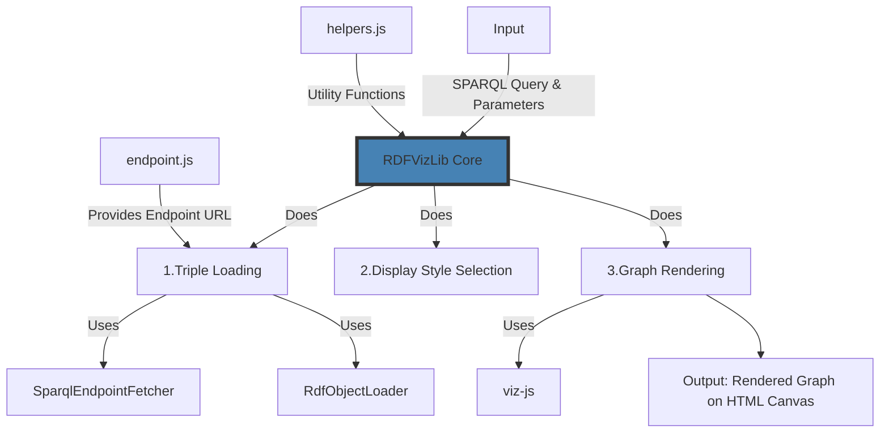
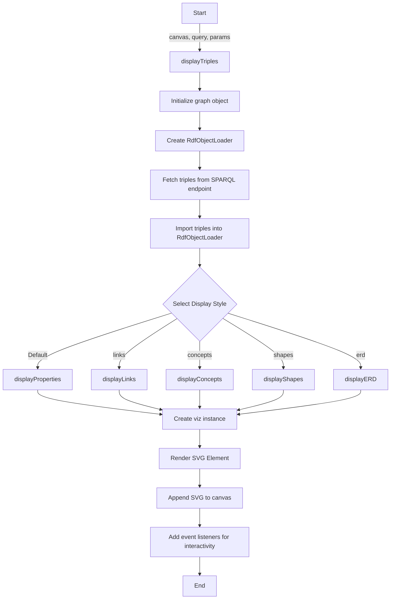

# RDFVizLib
RDFVizLib is a library for visualizing a graph from triples.

This overview can be found in [the modules overview](modules_overview.mermaid)

## Import statements
The code starts by importing various modules necessary for its functionality:

- Instance of `@viz-js/viz`: This module is used to display the visualized graph, using `viz.renderSVGElement`.
- `SparqlEndpointFetcher` from `fetch-sparql-endpoint`: This module helps retrieve triples from a SPARQL endpoint.
- `RdfObjectLoader` from `rdf-object`: This module is used to load the retrieved triples into an object model.
- `endpointModule`: This module (`endpoint.js`) contains the `getEndpoint` function that returns the URL of the SPARQL endpoint.
- `helperModule`: This module (`helpers.js`) contains helper functions used in the code, such as `_query.replaceAll("@"+param.toUpperCase()+"@",params[param])`, converting URI to label, and converting pt to pixels and vice versa.

## DisplayTriples function
The main function of this file is displayTriples(). In the [flowchart diagram](flowchart.mermaid) you can see the sequence of actions and function-calls that happen inside of the displayTriples() function.

### Inputs
This function accepts three arguments:

- canvas: The HTML canvas element on which the graph should be rendered.
- query: The SPARQL query to be executed.
- params: An object with parameters that influence the visualization.

### Tasks
The displayTriples function then performs three tasks:
1. Loading triples by passing the query and endpoint to SparqlEndpointFetcher and then loading this tripleStream into an object model of RdfObjectLoader (myLoader).
2. Determining which display style to follow depending on params.notation. This then calls one of the display_ functions.
3. Rendering the graph in the HTML canvas using `await myLoader.import(tripleStream).then(() => {instance().then(viz => { ... }}`.

### DisplayStyle
These functions receive the triples and the (initially empty) graph. Then it loops through the _resources. From this, the resourceURI is stored in 'myResource', and from that, the .property.label is stored in label.

Finally, the myResource.value and label.value are pushed to the graph.nodes list:
`graph.nodes.push({name: myResource.value, attributes:{label: {html: htmlLabel}}})`

And lastly, it iterates over the myResource.propertiesUri. For each resource, nodes and edges are pushed to graph.nodes:list and graph.edges:list.

#### default: displayProperties(myLoader.resources,graph);
This displays all resources.

#### case "links": displayLinks(myLoader.resources,graph)
This function only displays resources where myResource.property.label != "undefined". Then it iterates over the myResource.propertiesUri and only draws edges to resources where resource.property.label != "undefined".

#### case "concepts": displayConcepts(myLoader.resources,graph); break;
This function iterates over resourceURIs and only processes resources that contain both a type and a label, (typeof type != "undefined") && (typeof label != "undefined"). And if the type.value=="http://www.w3.org/2004/02/skos/core#Concept".
In processing the resource, the desc is loaded from myResource.property.comment. The desc is combined with the label to form an HTML table in const htmlLabel.
Finally, it iterates over the myResource.propertiesUri, and depending on the corresponding property, an arrowhead:"onormal" is given as an attribute, or no arrowhead. In any case, the edge is then pushed to graph.edges:list.

#### case "shapes": displayShapes(myLoader.resources,graph); break;
This function iterates over resourceURIs and only processes resources that contain both a type and a label, (typeof type != "undefined") && (typeof label != "undefined"). And if the type.value=="http://www.w3.org/ns/shacl#NodeShape".
In processing the resource, an HTML table is created containing the myResource.property.label.
Then it iterates over the myResource.propertiesUri, if the property=="http://www.w3.org/ns/shacl#property" the resource is processed.
In processing the resource, if resource.property.label != "undefined" it is added to the HTML table as a new row with 1 cell containing the resource.property.label as value.
If resource.property['sh:node']!= "undefined" the edge to this node is added to the graph.edges:list with the attribute {tailport: "p"+portnr}
Finally, the entire table is pushed to the graph via
`graph.nodes.push({name: myResource.value, attributes:{label: {html: htmlLabel}}});`

#### case "erd": displayERD(myLoader.resources,graph); break;
This function iterates over resourceURIs and only processes resources that contain both a type and a label, (typeof type != "undefined") && (typeof label != "undefined").

##### If the myResource.property.type.value=="urn:name:entity".
In processing the resource, an HTML table is created containing the myResource.property.label.
Then a row with 1 cell is created in the HTML table: (htmlLabel += "<tr><td align='left'>" + [resource.property['urn:name:card'].value] + "</td></tr>") for each resource that meets the following conditions:
if property=="urn:name:attribute" and resource.property.label!="undefined" and resource.property['urn:name:type'].property.label!="undefined" and resource.property['urn:name:card']!="undefined"
After iterating over all cells, this table is pushed as htmlLabel to graph.nodes:list

##### If the myResource.property.type.value=="urn:name:relationship".
In processing, a src and dest are determined based on myResource.property['urn:name:from'] and myResource.property['urn:name:to'].
The arrowtail is determined based on myResource.property['urn:name:fromCard'] and the arrowhead based on myResource.property['urn:name:toCard'].
Finally, an edge is defined with attributes;
tail: src.value, head: dest.value, attributes:{constraint: "false", minlen: "3.0", label: label, arrowhead: arrowhead, arrowtail: arrowtail}
This is pushed to graph.edges:list

##### If the myResource.property.type.value=="urn:name:classification".
sub- and superclass are defined based on myResource.property['urn:name:subclass'] and myResource.property['urn:name:superclass']
Then a node is pushed with the myResource.value to graph.nodes:list
Also, two edges are pushed to graph.edges:list. An edge with the subclass as tail and myResource as head, and an edge with the myResource as tail and the superclass as head.